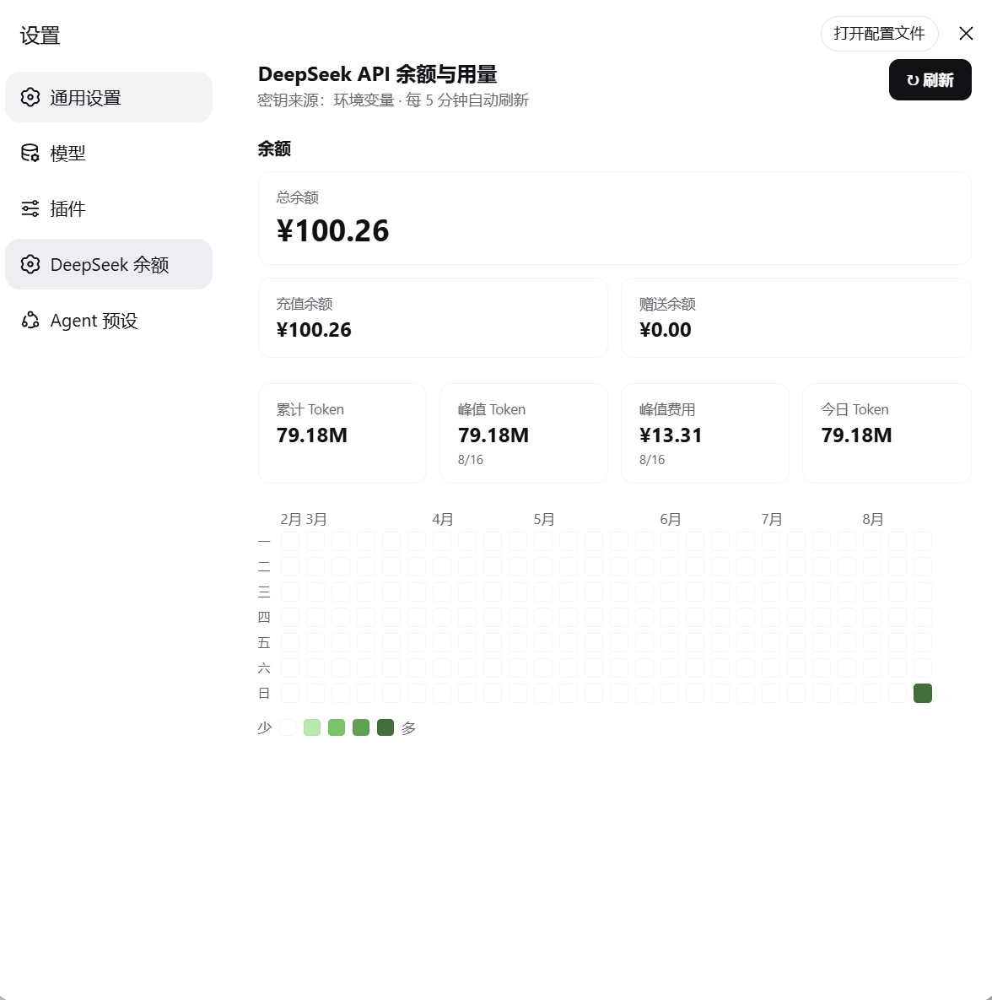

# DeepSeek Balance Dashboard

一个 [DeepSeek Harness (DSH)](https://github.com/deepseek-ai/deepseek-harness) 插件：在**设置面板**里展示 DeepSeek API 的余额，以及近 6 个月的 token 用量热力图（GitHub 贡献图风格）。



## 功能

- **余额**：总余额 / 充值余额 / 赠送余额（实时读取 DeepSeek 官方 `/user/balance` 接口）
- **Token 用量热力图**：近 6 个月，横轴月份、纵轴周一~周日；颜色深浅 = 当日 token 用量
- **悬停气泡**：黑底白字，展示某天的日期、token 数、费用
- **4 个统计卡片**：累计 Token / 峰值 Token（带日期）/ 峰值费用 / 今日 Token
- **自动追踪**：监听 `llm/stream`，把每次模型调用的真实 token 用量按天累加并持久化到本地文件

## 前置条件

1. 已安装 **DSH**（DeepSeek Harness）
2. DSH 里已配置 DeepSeek API Key（`DEEPSEEK_API_KEY` 凭据；DSH 默认用它跑模型，一般已配置好）

## 安装

### 方式一：让 DSH 代理自己装（推荐）

直接把本仓库的链接丢给 DSH 里的代理，对它说：

> 帮我安装这个 DSH 插件：https://github.com/yunhongfeng-tracy/deepseek-balance-dashboard ，按它的 README 安装。

DSH 代理会按下面「方式二」的步骤自动完成安装。

### 方式二：手动安装

```bash
# 1. 安装插件包（装到 DSH 能解析到插件名的地方；全局 DSH 用 -g）
npm install -g git+https://github.com/yunhongfeng-tracy/deepseek-balance-dashboard.git
```

```yaml
# 2. 在 DSH 的 cordis.yml（宿主组合或你的 agent preset）里加一行：
- id: deepseek-balance-dashboard
  name: 'deepseek-balance-dashboard'
```

> 如果 DSH 的 loader 找不到包名，把 `name` 换成包的实际路径即可，例如：
> `name: 'file:///path/to/deepseek-balance-dashboard'`

```bash
# 3. 重启 DSH，并重建 web bundle（让客户端半进入页面）
pnpm run dev:web    # 开发模式，或在部署里做一次 web 构建
```

4. 打开设置面板，左侧应出现「**DeepSeek 余额**」一页（和「通用 / 模型 / 插件」并列）。

## 验证

- 设置页出现「DeepSeek 余额」入口
- 余额卡片显示数字（不是报错）
- 热力图今天的格子有颜色，悬停出现黑底白字气泡

## 数据说明

- **余额**：来自 DeepSeek 官方接口，实时准确。
- **token 用量**：DeepSeek 没有公开的"每日用量"接口，本插件通过 `llm/stream` 钩子统计**本 DSH 实例**实际消耗的 token，因此从**安装后开始累积**；历史无数据。
- **费用**：由余额快照下降量估算，充值/赠送余额变动可能造成短暂失真。
- token 数据持久化在 DSH 进程启动目录下的 `.ds-deepseek-token-usage.json`。

## 目录结构

```
deepseek-balance-dashboard/
├── package.json      # 声明 dsh.client（客户端半）
├── lib/
│   ├── index.js      # 主机半：余额查询 + token 统计 + HTTP 路由
│   └── client.js     # 客户端半：设置页 UI
├── docs/
│   └── screenshot.png
└── README.md
```

## License

MIT
